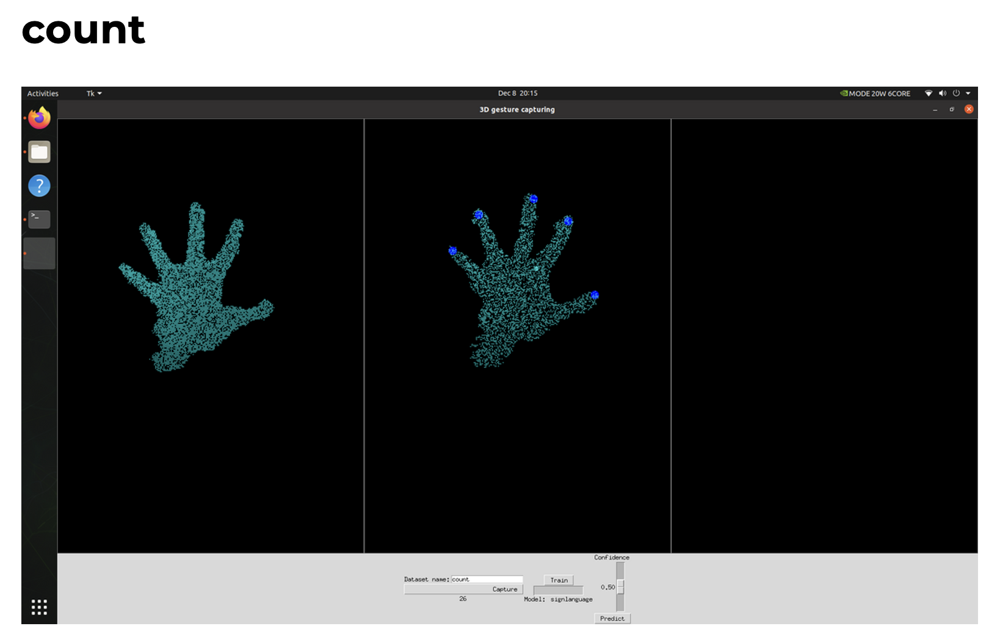
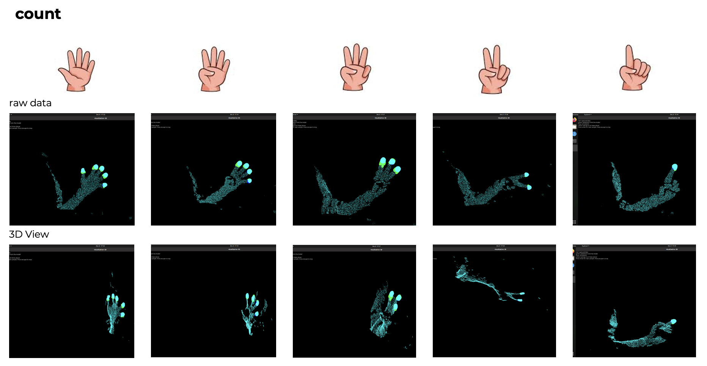
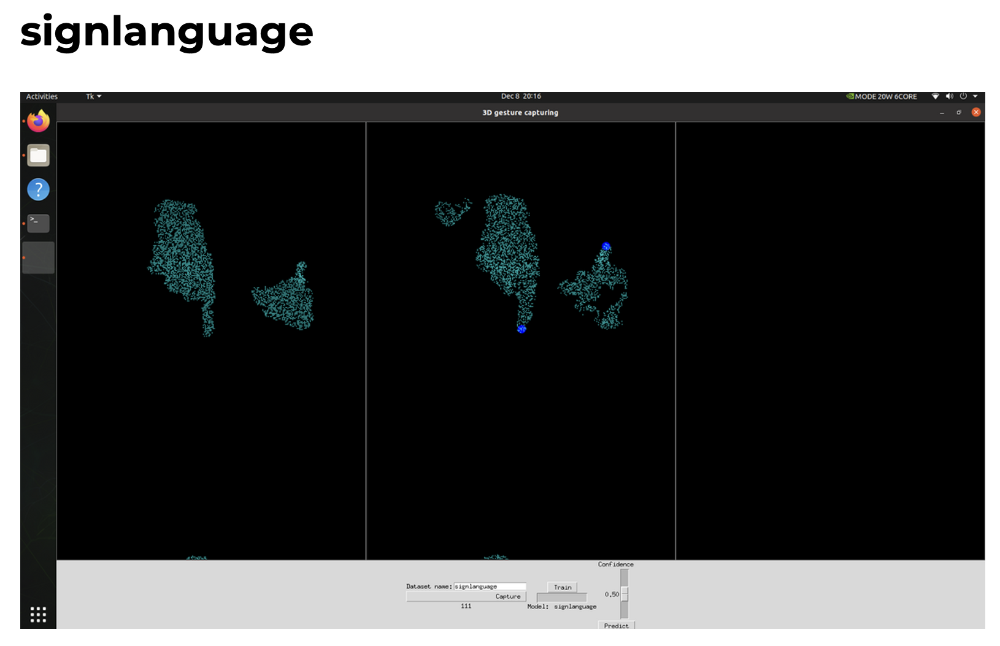
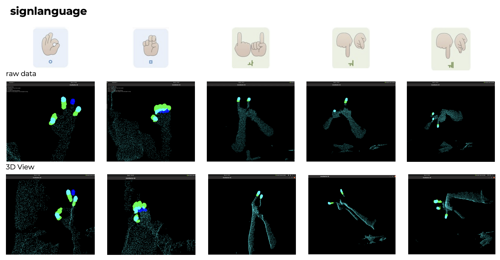
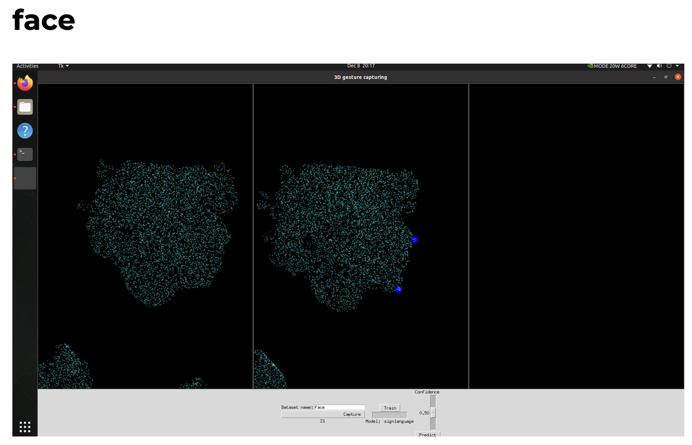
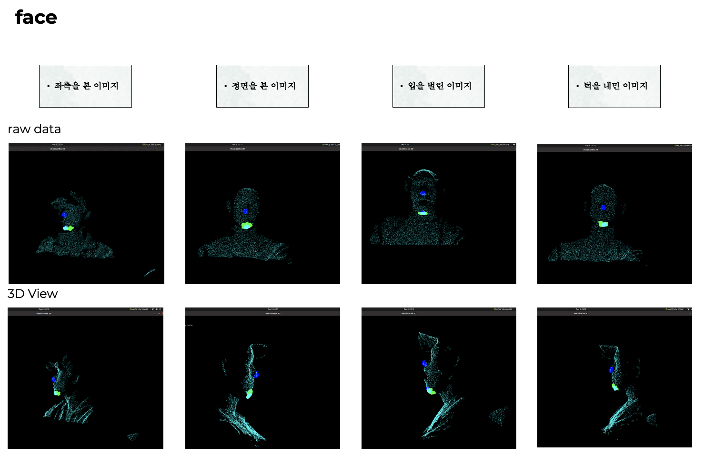

# 3D Recognizer — D455 adaptation archive

> **Non-runnable archival skeleton**
>
> This repository preserves a limited source skeleton showing an Intel RealSense D455 adaptation. It is intentionally incomplete and is not distributed as installable or executable software.

## Provenance

This project is a modified GitHub fork of [matthiasverstraete/3d_recognizer](https://github.com/matthiasverstraete/3d_recognizer). The upstream version reviewed for this archive was commit [`b4a02d2`](https://github.com/matthiasverstraete/3d_recognizer/commit/b4a02d24826b6f183bd45efce528fd9e5d3aa0d8).

The upstream project states that its RandLA-Net implementation was based on [aRI0U/RandLA-Net-pytorch](https://github.com/aRI0U/RandLA-Net-pytorch).

This archive must remain connected to the original repository through GitHub's fork mechanism. It must not be presented as an independently licensed original project.

## Changes represented in this archive

The local work focused on adapting the camera path and visualization for an Intel RealSense D455:

- `camera/__init__.py`
  - changed device discovery from an L515-specific name check to D400 product-line detection for D455 use;
  - added D455-oriented diagnostic output;
  - retained the mock-camera fallback structure;
  - corrected the repository-relative mock-data path in this archival copy.
- `camera/realsense_camera.py`
  - added a D455-oriented RealSense pipeline;
  - configured the depth stream at 848×480 and 60 FPS;
  - validated the D400 product line;
  - simplified the active depth-sensor options;
  - adjusted point-cloud depth filtering comments and experimentation points.
- `main.py`
  - changed the live prediction interval from 250 ms to 400 ms.
- `ui/vispy_view.py`
  - changed the primary point-cloud display color from red to cyan.

The remaining files are retained only to show the surrounding camera, dataset, application, and UI structure in which those changes were made.

## D455 point-cloud segmentation examples

The six screenshots below were captured directly by the maintainer during the D455 experiments and are published as visual documentation. The underlying raw point-cloud captures, annotations, datasets, and trained models are not included in this archive.

These experiments perform point-wise binary segmentation on 3D point clouds. They should not be interpreted as image classification, sign-language translation, or face identification. In the archived viewer:

- **cyan** represents the base point cloud;
- **blue** represents manually selected annotation points;
- **green** represents points selected by the model prediction.

### Finger-count examples

The foreground target is the fingertip region across hand poses representing counts from one to five. The training image records the data-capture and annotation interface; the inference image summarizes the resulting point-cloud segmentation across the captured poses.

| Training | Inference |
| --- | --- |
|  |  |

### Sign-language examples

The foreground target is the fingertip or hand-feature region across selected sign-language gestures. These screenshots document the segmentation targets and interface only; they do not demonstrate a complete sign-language classifier or translator.

| Training | Inference |
| --- | --- |
|  |  |

### Face-region examples

The foreground target is the feature region around the lips and chin. The overview includes variations in head direction, an open mouth, and a protruded-chin pose. These are segmentation experiments and do not perform face recognition or identity analysis.

| Training | Inference |
| --- | --- |
|  |  |

## Intentionally excluded

The following components are deliberately not published in this archive:

- captured, annotated, test, and mock point-cloud datasets;
- pretrained and locally trained model files;
- all visual assets other than the six maintainer-owned documentation screenshots above;
- training logs and evaluation output;
- the RandLA-Net implementation;
- KPConv-, nanoflann-, and torch-points-kernels-derived native source;
- model loading, prediction, and training scripts;
- Python dependency manifests;
- Dockerfiles, Docker images, and container run scripts;
- CMake output, compiled objects, caches, and generated files.

These exclusions avoid distributing assets whose redistribution rights were not independently confirmed and avoid publishing inherited model-loading, dependency, native-build, and container-security risks.

## Why this repository does not run

The preserved `main.py` and camera/UI modules reference components that are intentionally absent. In particular, this archive does not contain:

- model training or prediction implementations;
- model weights;
- point-cloud datasets;
- third-party segmentation implementation code;
- an installable dependency specification;
- a supported runtime or container environment.

No installation or execution support is provided. The source is retained only as a transparent record of the D455-oriented modifications within the fork.

## Archived structure

```text
.
|-- README.md
|-- THIRD_PARTY_NOTICES.md
|-- .gitignore
|-- main.py                       # Original application structure plus timing change
|-- dataset.py                    # Dataset interface retained for context
|-- docs/
|   `-- images/                   # Maintainer-owned D455 experiment screenshots
|       |-- count-overview.png
|       |-- count-ui.png
|       |-- face-overview.png
|       |-- face-ui.png
|       |-- signlanguage-overview.png
|       `-- signlanguage-ui.png
|-- camera/
|   |-- __init__.py               # D455/D400 discovery adaptation
|   |-- base_camera.py
|   |-- mock_camera.py
|   `-- realsense_camera.py       # D455 stream and sensor adaptation
`-- ui/
    |-- __init__.py
    |-- data_capturing_frame.py
    |-- label.py
    |-- prediction_frame.py
    |-- train_frame.py
    |-- vispy_canvas.py
    `-- vispy_view.py             # Point-cloud color change
```

## Security statement

The upstream development container used passwordless root SSH, privileged mode, host networking, an unconfined AppArmor profile, and broad local X11 access. All Dockerfiles and container scripts have been removed from this public archive.

The upstream model path used pickle-based PyTorch loading. Model loaders and model files have also been removed. This archive should not be treated as a secure runtime reference.

No secrets, credentials, underlying face/body/sign-language point-cloud datasets, local models, or training logs are included. Only the six maintainer-owned documentation screenshots shown above are retained as visual records.

## Licensing and copyright

The reviewed upstream repository does not contain a project-wide root open-source license. Accordingly, this archive does not add or claim an MIT, Apache, GPL, or other project-wide license.

- Original authors and contributors retain their respective rights.
- The GitHub fork relationship and upstream attribution must remain visible.
- Existing code must not be treated as generally licensed for independent redistribution or commercial use.
- Obtain written permission from the relevant copyright holders before publishing this work as an independent repository, distributing a Docker image, or using it commercially.

See [THIRD_PARTY_NOTICES.md](THIRD_PARTY_NOTICES.md) for provenance details. This repository and its documentation are an archival attribution record, not legal advice or a grant of rights.

## Research reference

The excluded segmentation implementation was based on RandLA-Net:

> Qingyong Hu, Bo Yang, Linhai Xie, Stefano Rosa, Yulan Guo, Zhihua Wang, Niki Trigoni, and Andrew Markham. **RandLA-Net: Efficient Semantic Segmentation of Large-Scale Point Clouds.** CVPR 2020. [arXiv:1911.11236](https://arxiv.org/abs/1911.11236)

```bibtex
@inproceedings{hu2020randla,
  title={RandLA-Net: Efficient Semantic Segmentation of Large-Scale Point Clouds},
  author={Hu, Qingyong and Yang, Bo and Xie, Linhai and Rosa, Stefano and Guo, Yulan and Wang, Zhihua and Trigoni, Niki and Markham, Andrew},
  booktitle={Proceedings of the IEEE/CVF Conference on Computer Vision and Pattern Recognition},
  pages={11108--11117},
  year={2020}
}
```
